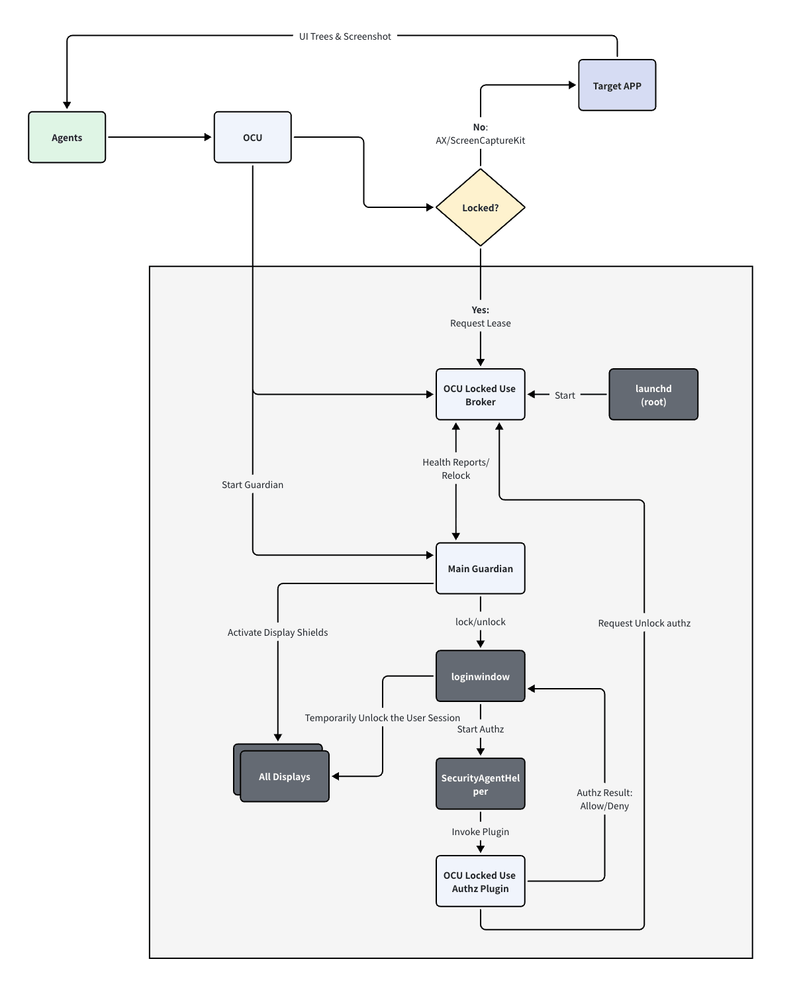

# Locked Use

[简体中文](locked-use.zh-CN.md)

Locked Use lets an agent keep using GUI apps while your Mac is locked. Shields cover every display during the task. When the task ends, or you move the mouse or press a key, the Mac locks again so you can unlock it normally.

## How to enable it

You need macOS 14 or later and a signed OCU app that includes the Locked Use components. For a source build, set `OPEN_COMPUTER_USE_INCLUDE_LOCKED_USE=1`.

Unlock your Mac normally, then run this command and complete the administrator prompt:

```bash
ocu locked-use enable --validation
```

This installs the components and enables validation mode. No manual configuration is needed. OCU's regular permission setup does not enable Locked Use automatically.

Use validation mode for testing for now. Full production validation is still incomplete. Running `ocu locked-use enable` without `--validation` does not allow automatic unlock unless valid validation records are present.

```bash
# Check installation and permissions
ocu locked-use status

# Disable and uninstall, restoring the original system lock-screen policy
ocu locked-use disable
```

## Required permissions

Allow these under **System Settings → Privacy & Security**:

| Component | Permissions | Purpose |
| --- | --- | --- |
| Open Computer Use | Accessibility, Screen Recording | Read and control the target app, and capture screenshots |
| OCU Guardian | Accessibility, Input Monitoring | Interact with the lock-screen UI and detect local keyboard or mouse takeover |

Installation and removal also require administrator authorization. Broker and the authorization plug-in do not need separate grants for these permissions. Development app names include `(Dev)`.

After installation, run this command to request Guardian's permissions, then follow the system prompts:

```bash
"/Library/Application Support/OpenComputerUse/LockedUse/OCU Guardian.app/Contents/MacOS/OCUGuardian" --request-permissions
```

## What gets installed

In this table, `ROOT` means `/Library/Application Support/OpenComputerUse/LockedUse`. The main app stays in your existing OCU installation. Enabling Locked Use adds:

| Component / file | Installation path | Purpose |
| --- | --- | --- |
| OCU Guardian | `ROOT/OCU Guardian.app` | Show shields and handle unlock, relock, and local takeover |
| Broker service | `ROOT/OCULockService` | Manage authorization permits, task leases, and protection state; runs as root |
| Installer | `ROOT/OCULockInstaller` | Install, remove, and recover components; runs with administrator privileges when needed |
| Authorization plug-in | `/Library/Security/SecurityAgentPlugins/OCULockAuth.bundle` | Ask Broker whether unlock is allowed during system authentication |
| launchd service definition | `/Library/LaunchDaemons/dev.opencomputeruse.locked-use.broker.plist` | Start and maintain the Broker service |
| State files | JSON files and the `run/` directory under `ROOT/` | App-managed installation, approval, validation, and recovery records, plus local communication sockets |

Installation also registers its own authorization rule and adds a Locked Use branch to `system.login.screensaver`, preserving the existing system authentication path. Normal uninstallation restores the original rule and removes the components above.

## How the services work together

OCU controls the target app. When the Mac is locked, it first requests a task lease from Broker. Broker decides whether the task may proceed. Guardian shields the displays, interacts with the lock-screen UI, and reports protection health. Once the system starts authentication, the authorization plug-in asks Broker for permission; the system completes authentication.

Guardian also has a separate watchdog process that uses the same app. It provides backup shields and recovery if the main protection process fails. There is no additional app to install for it.



In the diagram, OCU Locked Use Broker is `OCULockService`, and Authz Plugin is `OCULockAuth.bundle`. `loginwindow`, `SecurityAgentHelper`, and `launchd` are macOS components. The watchdog is not shown separately.
